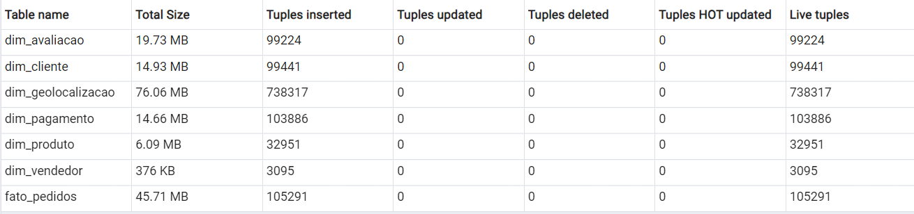

# Projeto de Data Warehouse com Pandas

Este projeto implementa um processo de ETL (Extração, Transformação e Carga) utilizando a biblioteca Pandas em Python. O objetivo é processar dados de vendas e organizá-los em um Data Warehouse estruturado em diferentes camadas para facilitar análises e tomada de decisão.

## Estrutura do Projeto

O projeto segue a arquitetura de Data Lakehouse, composta pelas seguintes camadas:

- **Landing**: Recebe os dados brutos, preservando sua forma original em arquivos CSV.
- **Bronze**: Converte os dados para o formato Parquet, garantindo otimização de armazenamento e desempenho.
- **Silver**: Realiza limpeza, padronização e transformação dos dados para garantir qualidade e consistência.
- **Gold**: Estrutura os dados em dimensões e fatos, aplicando agregações para facilitar análises de negócio.
- **Database**: Carrega os dados estruturados no PostgreSQL para consultas analíticas.

## Fluxo do Processo

- **Extração**: Os dados são coletados em formato CSV na camada **Landing**.
- **Transformação**:
  - Conversão dos arquivos CSV para Parquet (**Bronze**);
  - Limpeza e padronização dos dados (**Silver**);
  - Modelagem dimensional para a estrutura **Gold** (criação de dimensões e fatos).
- **Carga**: Os dados processados da camada **Gold** são carregados no **PostgreSQL**.

## Tecnologias Utilizadas

- **Python** (Pandas, PyArrow, SQLAlchemy)
- **PostgreSQL** (para armazenamento e consultas analíticas)
- **Parquet** (para armazenamento otimizado)

## Tabelas no PostgreSQL depois do Loading

  

## Estatísticas das Tabelas

  

